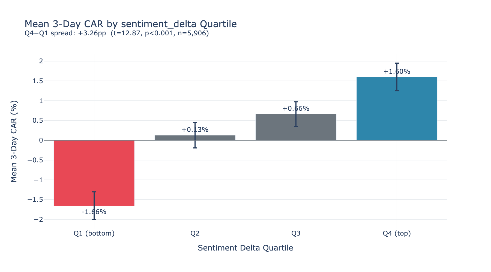
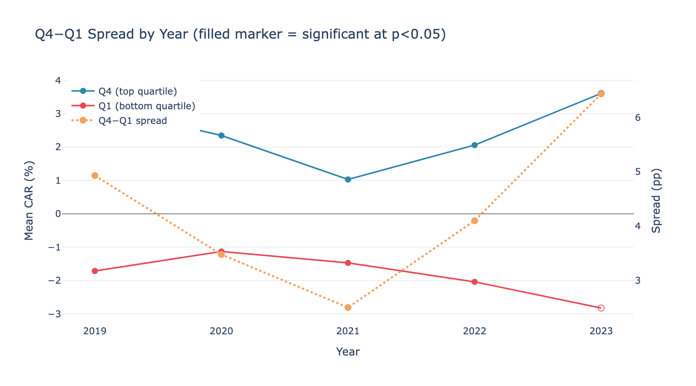
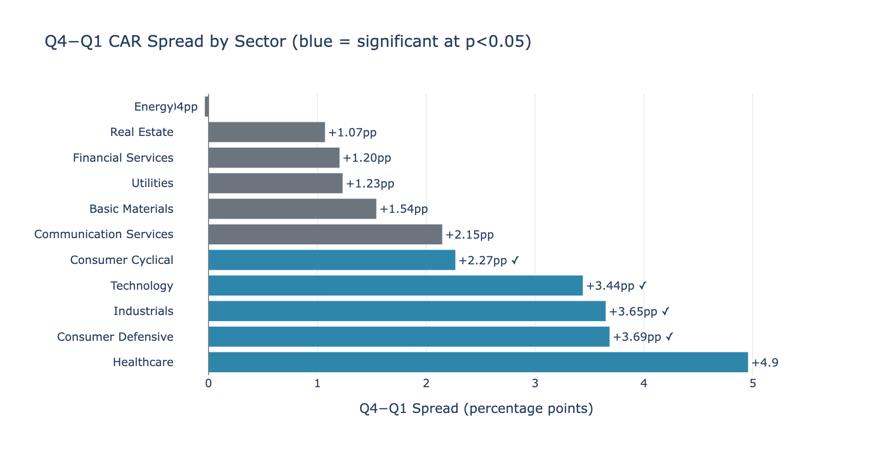

# Earnings Call NLP

Sentiment analysis of earnings call transcripts using FinBERT, covering 18,755 calls across 2,876 tickers from 2017–2023 (Motley Fool dataset).


*Events sorted by quarter-over-quarter sentiment shift. Q4−Q1 spread: +3.3pp (t=12.87, p<0.001, n=11,810).*

## Pipeline overview

```
Raw transcripts (.pkl)
        │
        ▼
  data_ingestion.py   — load, validate, standardize columns
        │
        ▼
  preprocessing.py    — parse sections → tag speakers → chunk
        │              (produces non-overlap + overlap chunks per transcript)
        ▼
  sentiment.py        — FinBERT inference → parquet cache
        │
        ▼
  signal testing      — compare chunking strategies, build return signals
```

## Notebooks

| Notebook | Description |
|---|---|
| [01_eda.ipynb](notebooks/01_eda.ipynb) | Dataset overview, transcript length, section and speaker distributions |
| [02_sentiment_analysis.ipynb](notebooks/02_sentiment_analysis.ipynb) | FinBERT score distributions, sentiment by section/role/time, overlap vs non-overlap |
| [03_signal_testing.ipynb](notebooks/03_signal_testing.ipynb) | Correlation analysis, regression, quantile staircase, sector breakdown, OOS validation |
| [04_results_summary.ipynb](notebooks/04_results_summary.ipynb) | Executive summary, key charts, limitations |

## Dataset

- **Source**: [Motley Fool Scraped Earnings Call Transcripts](https://www.kaggle.com/datasets/tpotterer/motley-fool-scraped-earnings-call-transcripts) (Kaggle)
- **Scale**: 18,755 transcripts, 2,876 unique tickers, 2017–2023
- **Format**: pickle file containing a DataFrame with columns: `ticker`, `date`, `exchange`, `q` (fiscal quarter), `transcript`
- **Coverage**: ~54% of transcripts have an explicit Q&A section; the remaining ~46% are parsed using a heuristic analyst speaker boundary

## Setup

```bash
brew install python@3.12
python3.12 -m venv .venv
.venv/bin/pip install -r requirements.txt
```

Download the dataset (requires Kaggle API credentials in `~/.kaggle/kaggle.json`):

```bash
.venv/bin/kaggle datasets download \
  -d tpotterer/motley-fool-scraped-earnings-call-transcripts \
  -p data/raw --unzip
```

## Preprocessing

`src/preprocessing.py` transforms raw transcript text into per-chunk DataFrames ready for inference. Each transcript goes through four stages:

### 1. Section parsing

Transcripts are split into `prepared_remarks` and `qa_session`. Three detection strategies are applied in order:

1. Explicit `"Questions and Answers:"` header line (~54% of transcripts)
2. Fallback: first analyst speaker line (`"Name -- Firm -- Analyst"`) after a minimum number of prepared-remarks lines (~46% of transcripts)
3. No Q&A found: entire body goes to `prepared_remarks`

### 2. Text cleaning

Boilerplate is stripped: operator procedural phrases, legal safe-harbour sentences, recording/replay notices. Speaker attribution lines and financial content are preserved.

### 3. Speaker tagging

Speaker turns are identified by `"Name -- Title"` or `"Name -- Firm -- Analyst"` lines. Each speaker is assigned a coarse role label: `ceo`, `cfo`, `executive`, `ir`, `analyst`, or `operator`.

### 4. Chunking — two strategies

This is the key design decision. FinBERT has a hard 512-token limit, so transcripts must be split into chunks. Two strategies are produced for every transcript:

**Non-overlap (speaker-turn chunking)**
Each chunk corresponds to one speaker turn. Long turns are split at sentence boundaries to stay under 512 tokens. Chunks are independent and speaker-attributed — a CEO's prepared remarks are a separate chunk from the CFO's, and separate from analyst questions. This is the natural unit of earnings call discourse.

**Overlap (50%-stride sliding windows)**
All speaker turns within a section are concatenated into a single text, then chunked using a sliding window with 50% stride. Each chunk overlaps by half with the previous one. Speaker attribution is lost (chunks are labelled `"mixed"`), but sentiment that falls at a non-overlap chunk boundary is captured.

**Why both?** Sentiment in financial text is often expressed across sentence and turn boundaries. A CFO might hedge a strong statement in the following sentence, or a CEO might qualify remarks made earlier in the same section. The non-overlap strategy can split these in half — one chunk gets the positive signal, the next gets the hedge — and the sentiment averages out. The overlap strategy mitigates this by ensuring that every sentence appears in at least two chunks. Both strategies are scored and compared during signal testing to determine which produces more predictive sentiment signals. The overlap chunk count is typically ~70% of the non-overlap count (not double, because the 50% stride advances by half a window at a time and many turns are short enough to fit in a single chunk under either strategy).

## Return calculation (CAR)

Post-earnings stock performance is measured as **Cumulative Abnormal Return (CAR)** — the stock's return minus the S&P 500 (SPY) return over 1, 3, and 5 trading days following the call.

### Earnings window timing

Getting the start of the return window right matters. The rule used here:

- **Call before 4:00 p.m. ET** (morning or midday) → window starts on the earnings date itself. The market is open and reacts immediately; using the same calendar day captures the full reaction and avoids losing a day of signal.
- **Call at or after 4:00 p.m. ET** (after market close) → window starts the *next* trading day. The market is closed when the call happens, so the earliest possible reaction is the following morning. Using the earnings date here would capture pre-call returns — noise, not signal.
- **Time unknown** → next trading day (conservative fallback).

Call times are extracted directly from the raw dataset timestamps (e.g. "Aug 27, 2020, 9:00 p.m. ET"). This is preferable to defaulting all events to next-day, because morning calls — which make up a meaningful portion of the dataset — lose a full day of reaction time under a conservative blanket rule, compressing the measurable signal.

### Sample coverage and survivorship bias

20.1% of earnings events (3,526 of 17,542) are excluded from the return analysis due to missing price data — yfinance cannot find historical prices for tickers that have since been delisted, acquired, renamed, or taken private. These 670 missing tickers are disproportionately **small-cap companies**: the excluded events have a median market cap of $1.1B vs $5.0B for the retained sample. Healthcare (likely small-cap biotech/pharma) and Communication Services are overrepresented among the missing.

This introduces survivorship bias. The analysis sample skews toward larger, more established companies that continued trading through 2017–2023. Companies that failed or underwent distressed M&A are largely absent. Signal findings are more applicable to mid- and large-cap equities — extrapolating to small-cap or speculative names should be done with caution.

### Benchmark and adjustment methods

- **Primary**: market-adjusted CAR — stock return minus SPY return each day, summed over the window
- **Robustness check**: beta-adjusted CAR — expected return is beta × SPY return, where beta is estimated on the 120 trading days prior to the event (non-overlapping with the CAR window)

### Regression model specification

Two model variants are reported for each CAR window:

- **Full-sample model** (~14,000 events): sentiment features only, no size control. Uses every event with available price data.
- **Controlled model** (~8,200 events): adds `log(market_cap)` and sector fixed effects as controls. Restricted to tickers for which yfinance returned a market cap — a non-random subsample that skews mid- to large-cap (median $5.0B vs $1.1B for the excluded names).

The full-sample model is the primary specification. The controlled model is a robustness check: if sentiment coefficients are stable across both, the signal is not simply a proxy for size or sector effects. The ~5,800 event gap between the two samples is itself a finding — the analysis cannot be extended to the small-cap universe without a separate market-cap data source.

`earnings_surprise` (analyst consensus beat/miss) is not in the dataset and is omitted. This is an intentional scope decision: the hypothesis under test is whether *how management talks* predicts returns, not whether reported numbers beat expectations. The two signals are correlated in practice — a positive sentiment delta may partly reflect a genuine beat before it is fully priced in — but that is a plausible economic channel rather than a confound to eliminate.

## Signal testing findings

### Quantile analysis

Sorting earnings events into quartiles by `sentiment_delta` (quarter-over-quarter tone change) produces a monotonic CAR_3d pattern with no inversions:

| Quartile | Mean sentiment delta | Mean 3-day CAR |
|---|---|---|
| Q1 (most negative tone shift) | -0.093 | -1.66% |
| Q2 | -0.019 | +0.13% |
| Q3 | +0.025 | +0.66% |
| Q4 (most positive tone shift) | +0.100 | +1.60% |

**Q4-Q1 spread: +3.3 percentage points** (Welch t=12.87, p<0.001, n=11,810 events).


### Alpha decay

The Q4-Q1 spread by year shows no evidence of monotonic decay:

| Year | Spread | Significant |
|---|---|---|
| 2019 | +4.93% | Yes |
| 2020 | +3.48% | Yes |
| 2021 | +2.50% | Yes |
| 2022 | +4.10% | Yes |
| 2023 | +6.43% | No (n=80, partial year) |

2017–2018 are excluded: `sentiment_delta` requires a prior-quarter call, so 2017 has zero valid observations and 2018 fewer than 50. The 2021 dip (lowest spread at +2.5%) coincides with the meme-stock / COVID-recovery regime — anomalous market conditions rather than structural decay. The signal recovers fully in 2022.



### Sector breakdown

The signal is concentrated in sectors where management language carries forward-looking information the market hasn't fully priced. It is weak or absent in sectors where returns are driven by macro factors outside management's control:

**Signal present** (spread significant at p < 0.05): Healthcare (+4.96%), Consumer Defensive (+3.69%), Industrials (+3.65%), Technology (+3.44%), Consumer Cyclical (+2.27%).

**Signal absent**: Communication Services, Basic Materials, Financial Services, Real Estate, Utilities, Energy.

The pattern is economically coherent:
- **Utilities**: Regulated, bond-proxy behaviour. Stock prices respond to rate expectations and dividend yield, not management tone. Low CAR dispersion in both tails compresses the measurable spread.
- **Energy**: Commodity-price driven. The macro oil/gas signal overwhelms any tone information — Q4 and Q1 mean CARs are nearly identical (-0.003 vs -0.003).
- **Basic Materials**: Same commodity-cycle logic as Energy.
- **Communication Services**: A mixed sector spanning regulated legacy telecom (Utilities-like) and growth streaming/social (Tech-like); the two sub-groups likely offset each other.
- **Financial Services**: Heavily compliance-constrained language reduces FinBERT's discriminating power; investors focus on loan book quality, NIM, and capital ratios rather than tone.



## FinBERT inference

Model: [ProsusAI/finbert](https://huggingface.co/ProsusAI/finbert) via HuggingFace Transformers. Three output probabilities per chunk: `positive_prob`, `negative_prob`, `neutral_prob` (sum to 1.0).

> **This step takes a long time — even on capable hardware.**
>
> The dataset produces ~2 million chunks across both chunking strategies. On Apple Silicon MPS (Mac Mini), each batch of 1,750 transcripts takes roughly 2.5–3 hours. The full 11-batch run is a **25–30 hour** wall-clock commitment. Plan accordingly: start the run before an overnight or a long away-from-keyboard window. The pipeline is fully resumable — partial results are written after each batch and the next run auto-detects where to continue.

Inference commands:

```bash
# Run next batch (~1,750 transcripts, auto-resumes from last completed batch)
PYTHONPATH=. .venv/bin/python3.12 src/sentiment.py

# Check progress
PYTHONPATH=. .venv/bin/python3.12 src/sentiment.py --status

# Force a specific start index
PYTHONPATH=. .venv/bin/python3.12 src/sentiment.py --start 3500

# After all 11 batches complete, assemble final cache files
PYTHONPATH=. .venv/bin/python3.12 src/sentiment.py --merge
```

Cache layout (`data/cache/`):

```
partials/
  nooverlap_000000_001750.parquet   ← batch partial files
  overlap_000000_001750.parquet
  ...
finbert_scores_nooverlap.parquet    ← final merged cache (after --merge)
finbert_scores_overlap.parquet
finbert_scores_nooverlap.json       ← provenance sidecar
finbert_scores_overlap.json
```

### Technical notes

- **Batch size**: 32 chunks per forward pass — MPS parallelism saturates quickly at FinBERT's sequence lengths; larger batches don't meaningfully increase throughput
- **Truncation**: chunks estimated at >512 tokens are truncated by the tokenizer; a warning is emitted at inference time. Tightening the chunking limit in preprocessing would eliminate these.
- **Hardware tested**: Mac Mini (Apple Silicon MPS), ~2.5–2.75 hours/batch; MacBook Air M4 (thermal throttling under sustained load), ~5.5 hours/batch
- **Score validation**: a 100-chunk sample was reviewed before committing to the full run — scores were qualitatively sensible (neutral ~67%, positive ~21%, negative ~12%; clearly positive/negative examples validated manually)
